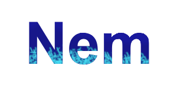

# Nem Programming Language



[](https://badge.fury.io/gh/nemanjamiric%2Fnem-language)
[](https://github.com/nemanjamiric/nem-language/blob/master/LICENSE)

## Description
Nem is a dynamic, weakly-typed programming language.
The repository contains an interpreter for Nem written in Python.

## Goal
I've always been interested in learning more about programming language design and how to create your own programming language.
This is the first time I've ever tried to create one, with the goal of learning more about how interpreters work.
Working on Nem made me a lot more comfortable with lower-level technologies, such as interpreters and even compilers.

As it stands, Nem is exclusively an interpreted language.
It uses a tree-based execution model as opposed to byte-code.

## Installation
1. Clone the repository with `git clone https://github.com/nemanjamiric/nem-language`;
2. Change your current working directory to `nem-language`;
3. Run `pip install .` (or `make` if preferred).

## Usage
```
$ nemrun
Usage: nemrun [[-h, --help] | [-v, --version] | [-l, --license] | [file]]
        -h, --help      Show help.
        -v, --version   Show version.
        -l, --license   Show license.
```

## OS Support
The interpreter was built on Windows 10.
It hasn't been tested on any other operating system.
